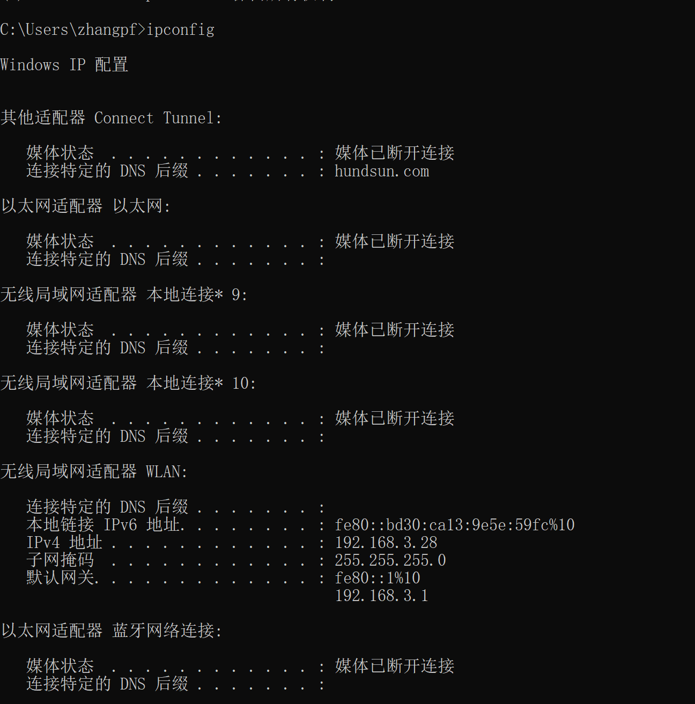
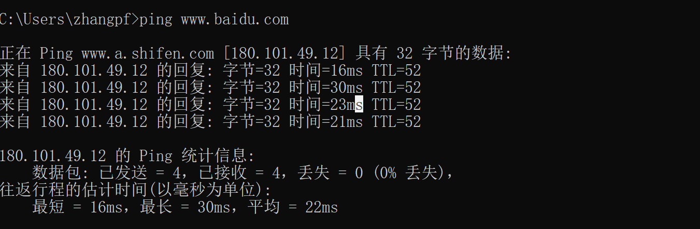

# Dos命令

## 1. 常用的命令

### 1.1 打开dos窗口

> win +R，默认打开位置为C:\Users\用户名

### 1.2 创建文件夹

> mkdir + 文件名
>
> ```
> eg: 新建test1文件夹
> C:\Users\zhangpf>mkdir test1
> ```

### 1.3 复制Dos窗口内容

> win 10：选中内容后，右键单击一下，内容即复制到剪贴板中了

### 1.4 切换盘符

> 输入要切换的磁盘名称 + :
>
> ```
> eg:
> C:\Users\zhangpf>d:
> D:\>
> ```

### 1.5 切换目录(cd 命令)

> cd ： change directory（改变路径）
>
> 使用方法：cd +空格+ 路径(可以为绝对路径或相对路径)
>
> cd .. :回到上一级目录，..其实也是一个相对路径，表示上一级，.也是一个相对路径，表示当前路径
>
> cd\ :回到根目录

### 1.6 清屏(cls命令)

### 1.7 查看当前路径下文件(dir命令)

### 1.8 删除文件

> del 文件名
>
> 支持模糊匹配：如删除所有的txt文件：del *.txt

### 1.9 退出Dos窗口(exit命令)

### 1.10 查看ip地址(ipconfig命令)

>ipconfig:查看ip配置信息
>
>ipconfig /all:查看详细信息，包括网卡的MAC地址等
>
>

### 1.11 ping + ip/域名

> 
>
> ping + ip地址 -t ：一直ping此ip地址（可以查看网络是否稳定）

### 1.12 终止命令

> 终止命令：Ctrl + C
