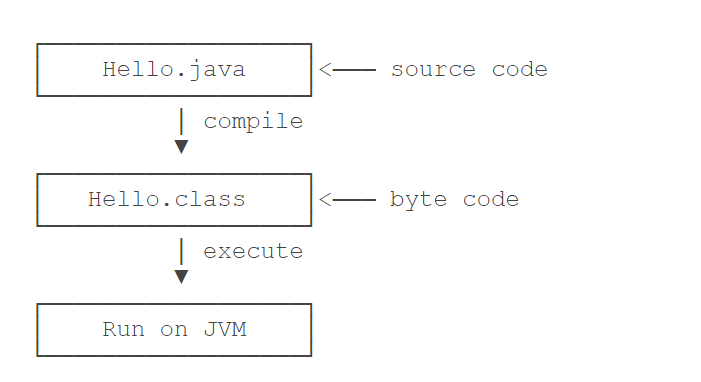

# Java简介

## 1. JDK

### 1.1 安装jdk

### 1.2 配置环境变量

### 1.3 安装路径bin目录下内容

>1. java.exe : 这个可执行程序其实就是JVM(java虚拟机)，运行Java程序，就是启动JVM，然后让JVM执行指定的编译后的代码
>2. javac.exe Java的编译器，用于把java源代码(.java文件)编译为Java字节码文件（.class文件）
>3. jar文件：用于把一组.class文件打包成一个.jar文件，便于发布
>4. javadoc.exe：用于从Java源码中自动提取注释并生成文档
>5. jdb.exe ：Java调试器，用于开发阶段的运行调试

## 2. 第一个Java程序

### 2.1 Helloworld编写

```java
public class Helloworld {
    public static void main(String[] args) {
        System.out.println("Hello world");
    }
}
```

- 类似上文中编写的Helloworld类，**类名首字母通常大写**
- 在Helloword类中，定义了一个方法，方法的编写方式为：

> (public/protected/private) + (static) +数据类型 + 函数名(数据类型 + 变量名

- java规定，某个类定义的public static void main(String[] args)是java程序的固定入口方法，因此，Java程序总是从main方法开始

- 当我们把代码保存为文件时，文件名必须是`Hello.java`，而且文件名也要注意大小写，因为要和我们定义的类名`Hello`完全保持一致。

### 运行Java程序

Java源码本质上是一个文本文件，我们需要先用`javac`把`Hello.java`编译成字节码文件`Hello.class`，然后，用`java`命令执行这个字节码文件：



因此，运行一个.java文件的通常过程为：

1. javac Hello.java -->使用javac.exe编译生成字节码文件.class
2. java Hello -->使用java.exe执行.class文件

## 3. 使用IDE

IDE是集成开发环境：Integrated Development Environment的缩写。

使用IDE的好处在于，可以把编写代码、组织项目、编译、运行、调试等放到一个环境中运行，能极大地提高开发效率。

IDE提升开发效率主要靠以下几点：

	- 编辑器的自动提示，可以大大提高敲代码的速度；
	- 代码修改后可以自动重新编译，并直接运行；
- 可以方便地进行断点调试。

目前，常用的Java开发IDE为：Eclipse和IntelliJ Idea

