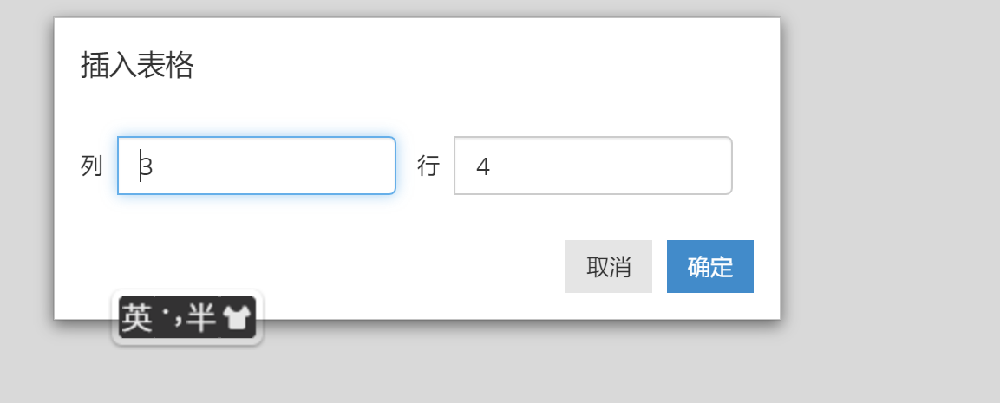

# markdown语法与快捷键

## 1. 字体编辑

### 1.1 标题

> \# 一级标题  快捷键：Ctrl + 1
>
> \## 二级标题  快捷键：Ctrl + 2
>
> 以此类推...

### 1.2 字体加粗

> \**加粗内容\*\*     快捷键: Ctrl + B
>
> eg: **加粗内容**

### 1.3 倾斜

> \*倾斜内容*  快捷键：Ctrl + i
>
> eg: *倾斜内容*

### 1.4 删除线

> \~~删除内容~~  快捷键：Alt + Shift + 5
>
> eg: ~~删除内容~~

### 1.5 下划线

> \<u>下划线内容</u> 快捷键：Ctrl + u
>
> eg: <u>下划线内容</u>

### 1.6 文本居中

> \<center>居中内容</center>
>
> <center>eg: 居中内容</center>

### 1.7 转义字符

> markdown中使用\进行转义，如：想显示#,则输入\\#,想显示\,则输入\\\，其他同理。

### 1.8 上标

> 文字\^上标内容\^
>
> eg: 文字^上标内容^	

### 1.9 下标

> 文字\~下标内容~
>
> eg:文字~下标内容~

### 1.10 文字高亮

> \==高亮文字==
>
> eg: ==高亮文字==

## 2. 列表

### 2.1 有序列表

> 1. list1
>
> 2. list2

### 2.2 无序列表

> - list_1
> - list_2

## 3. 插入

### 3.1 插入代码块

> 快捷键：shift + ```
>
> eg:
>
> ```plsql
> select a.*,a.rowid from dual a;
> ```

### 3.2 插入数学公式


> 操作：$$ + 回车
> $$
> 11 + 12 - 3 = 20
> $$

### 3.3 插入引用

>操作： > + 空格

### 3.4 插入链接

> 操 作:Ctrl+k弹出后，输入 [输入标题名](输入链接地址) 即可
> 示 例1：[百度一下，你就知道](https://www.baidu.com/)
> 示 例2：这是 [百度一下，你就知道](https://www.baidu.com/ "百度") 的链接.  
> 示 例3：这是 [github][1] 的链接.  
> [1]: https://github.com/ "github"
> ps：按住ctrl点击链接可直接打开

### 3.5 插入注释

> 操作：[\^文字]：
>
> eg:文献[^1]
>
> [^1]: www.baidu.com

### 3.6 插入表格

> 快捷键：ctrl + t
>
> 示例：按完快捷键后，弹出窗口，选择行和列即可
>
> eg:
>
> 
>
> | 1/1  | 1/2  | 1/3  |
> | ---- | ---- | ---- |
> | 2/1  |      |      |
> | 3/1  |      |      |
> | 4/1  |      |      |

### 3.7 插入图片

> 直接拖动或ctrl+shift+i(相对路径地址)
>
> eg：


