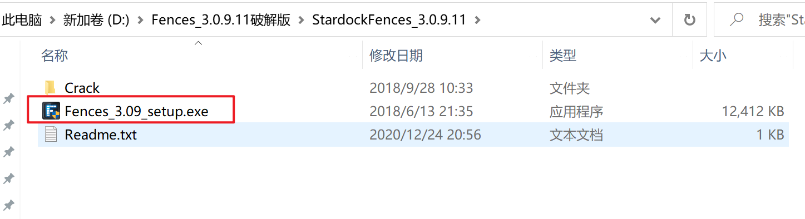
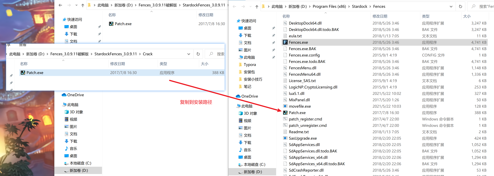
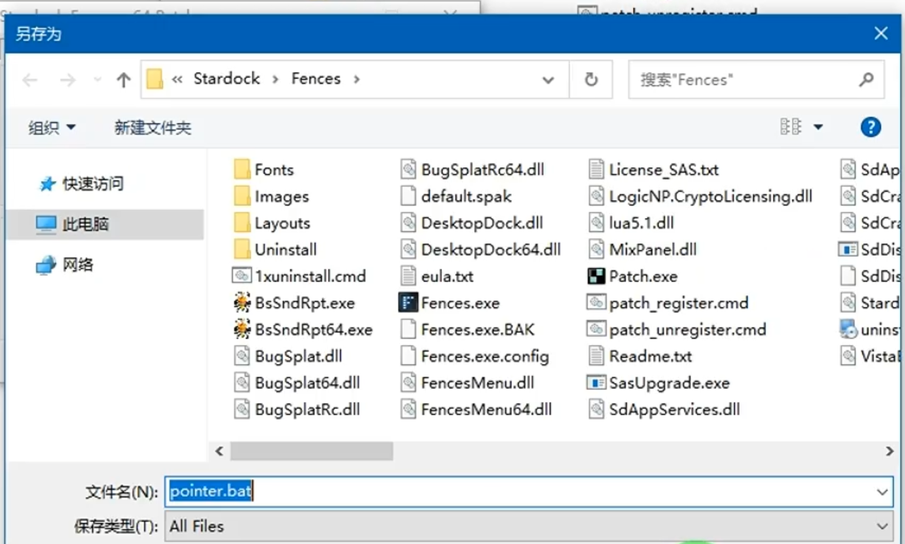
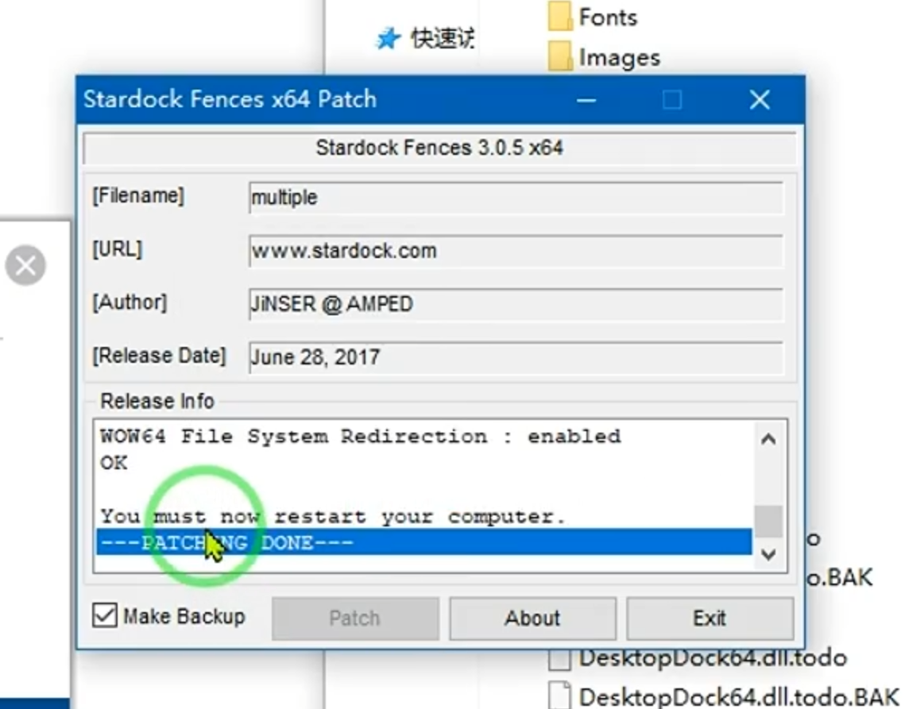

# Fences桌面整理软件破解

1. 下载文件：Fences_3.0.9.11破解版.zip

2. 解压文件后安装文件

3. 安装后，忽略输入产品秘钥提示，将Crack文件夹下的Patch.exe拷贝到安装路径

   

4. 以管理员身份运行安装路径下的Patch.exe文件，会弹框选择下载pointer文件路径，默认选择Fences安装路径即可

   

5. 执行完成后，根据提示重启电脑即可

   

