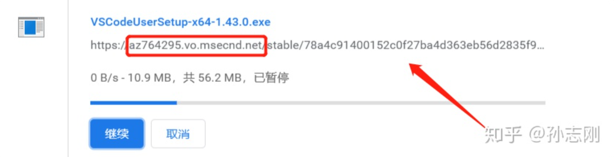

# Vscode下载安装包很慢解决方法

首先在官网找到需要下载的文件，点击下载。

在浏览器或者下载软件中就可以看到这么一个下载地址了，将其复制下来（如下图箭头所指）

然后将红框内的部分更换为如下内容：

[vscode.cdn.azure.cn](https://link.zhihu.com/?target=http%3A//vscode.cdn.azure.cn/) <--------就是左边这个

更新后的地址为：[http://vscode.cdn.azure.cn/stable/78a4c91400152c0f27ba4d363eb56d2835f9903a/VSCodeUserSetup-x64-1.43.0.exe](https://link.zhihu.com/?target=http%3A//vscode.cdn.azure.cn/stable/78a4c91400152c0f27ba4d363eb56d2835f9903a/VSCodeUserSetup-x64-1.43.0.exe)

这个就是国内的镜像了点开后你会发现速度直接起飞。

抄自：[国内下载vscode速度慢问题解决 - 知乎 (zhihu.com)](https://zhuanlan.zhihu.com/p/112215618)

