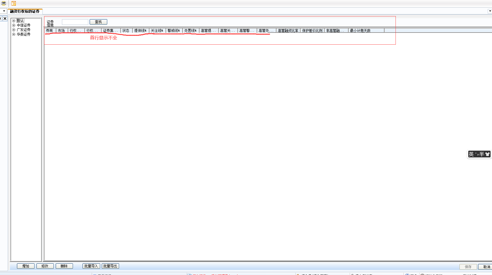
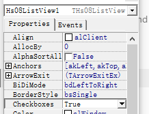
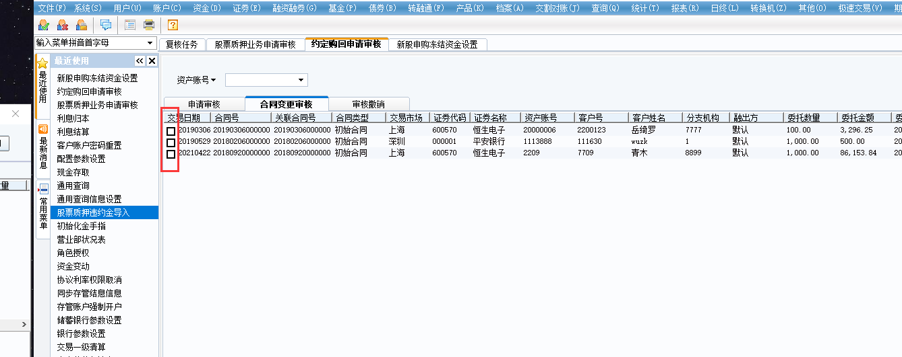

# listview控件设置

- HeaderColor: $00FBF2E8

- FrameHotTrack：false

- FrameStyle：fsnone

- FrameVisible：true

- OwnerDraw：true

如果出现listview的首行（列头）显示不全问题：

1.下图这种情况，尝试修改listview的字体格式：设置为宋体，9号，如果原本即为宋体，9号字但显示仍有问题，尝试修改字符集，如原来是西欧语言，改为GB2312尝试，原来是GB2312，则改为西欧语言尝试，基本问题都可解决。

2.控件可勾选

如果想设置为可勾选，则设置为：checkboxes属性为：True

