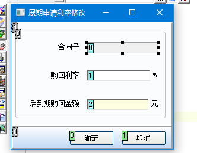

# onvalidate事件注意事项

- onvalidate事件在输入框内容发生变化，且焦点发生变化的时候触发
- 注意，如果A输入框的onvalidate事件不能触发，有可能是A输入框下面一个控件的enable属性:false，可以通过把控件改成read_only：true，enable:true

> 参考:
>
> 
>
> 利率输入框的onvalidte事件没触发，因为把购回金额的输入框的enable设置为了false，通过把购回金额输入框的enable设置成true，readonly设置为false，得以解决

