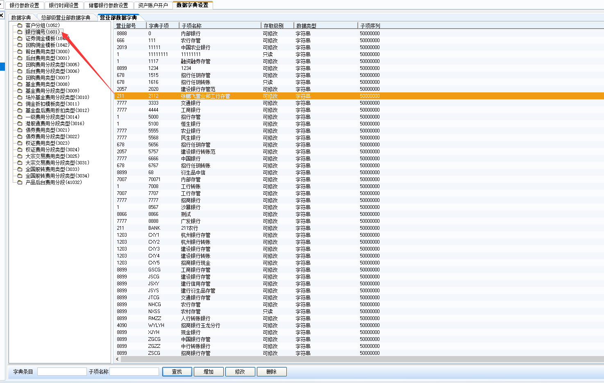
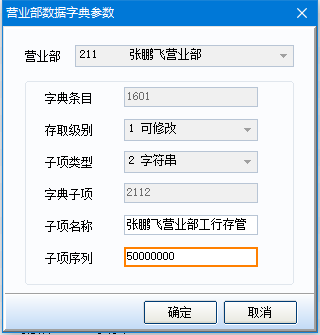
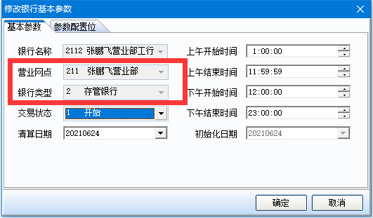
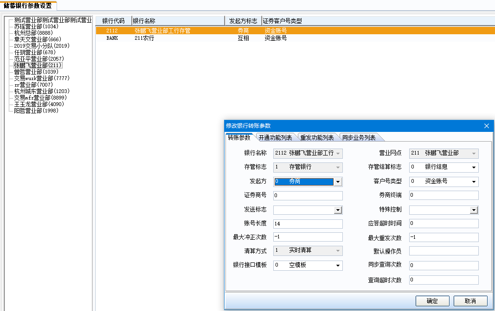
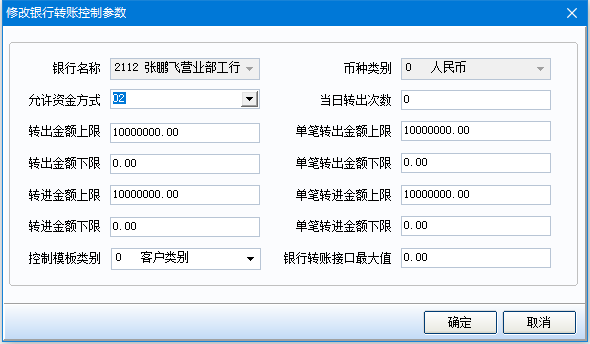
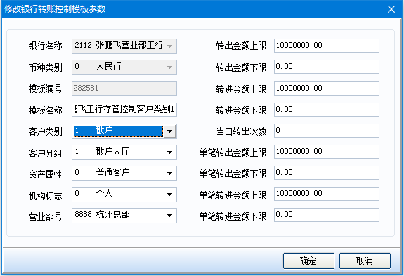
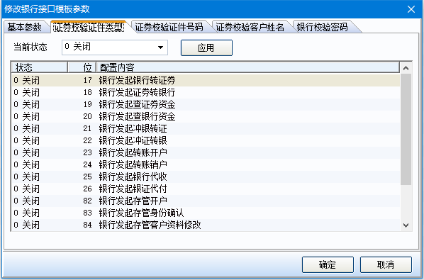
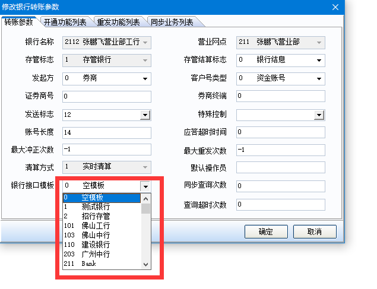

# 银行转账账户开户

## 1.涉及表结构，及其常用字段

- bankarg：银行参数表（唯一索引：bank_no） **记录银行最基本的一些参数信息**

| 列名          | 含义     | 解释                                                         |
| ------------- | -------- | :----------------------------------------------------------- |
| bank_no       | 银行代码 |                                                              |
| bank_name     | 银行名称 |                                                              |
| bank_type     | 银行类型 | 0:转账银行 1:银证通 2:存管银行 3:基金买卖网 4:融资融券存管银行 5:银衍转账银行 8:现金银行 9:支付银行 |
| branch_no     | 营业部   |                                                              |
| init_date     | 交易日期 |                                                              |
| bank_status   | 交易状态 | 0：停止 1：运行                                              |
| business_date | 成交日期 | 银行的清算日期                                               |
| bankarg_flag  | 参数配置 | 每一位都代表一项配置，类似stkholder_ctrlstr、stkcode_ctrlstr |
| ds_date       | 日切日期 |                                                              |
| 时间          | 时间     | 包括上午开始时间、上午结束日间、下午开始时间、下午结束时间   |

每个银行代码都只能有一个指定营业部、并且银行代码的银行类型bank_type设置后就固定了，不能修改，可修改内容为：交易状态、时间、参数配置位。

- bankexcharg:储蓄银行参数表

| 列名          | 含义               | 解释                                                         |
| ------------- | :----------------- | ------------------------------------------------------------ |
| bank_no       | 银行编号           | 银行编号                                                     |
| branch_no     | 营业部             | 营业部                                                       |
| source_flag   | 发起方             | 发起方标志 0 券商发起，1 银行发起，2 双方均可发起            |
| account_type  | 账户类型           | 账户类型 0 资产账号 1 银行账号 2 股东内码 3 证券账号 4 资金卡号 |
| account_len   | 账号长度           | 账号长度                                                     |
| security_no   | 证券商号           | 证券商号，证券公司在银行端的证券商号，如在A银行为1，在B银行可能为1，也可能为2 |
| terminal_no   | 证券商终端号       | 证券商终端号，使用场景未知                                   |
| time_out      | 超时时间           | 应答超时时间(冲正时间间隔)，单位：秒                         |
| info_send     | 发送标志           | 发送标志：1 开户，2 销户，3 挂失，4 解挂，5 冻结，6 解冻     |
| bank_control  | 特殊控制           | 特殊控制，比如： 1 使用存款密码，2 允许查询余额              |
| square_type   | 日终清算方式       | 日终清算方式，日间应该不使用 日终清算方式：0 非实时清算，1 实时清算 |
| strike_times  | 冲正次数           | 最大冲正次数 0表示无限次，-1表示不发  (冲正次数使用场景，未知) |
| open_flag     | 开通功能配置串     | 开通功能配置串，每位表示一功能开通情况，0-关闭，1-开放，2-无密码开放，3-不校验证件，4-无限制开放 |
| trust_flag    | 存管标志           | 存管标志 0 转账银行，1 存管银行                              |
| interest_flag | 结息标志           | 结息标志 0 银行结息，1 证券结息，2 按证券同步结息，3 按银行同步结息 |
| synchro_flag  | 同步功能配置串     | 同步功能配置串，每位表示一功能同步情况，0-不同步，1-同步     |
| resend_flag   | 重发功能配置串     | 重发功能配置串，每位表示一功能同步情况，0-不重发，1-重发     |
| resend_times  | 重发次数           | 最大重发次数 0表示无限次，-1表示不发                         |
| bank_model_no | 银行接口模版编号   | 设置的银行接口模板编号，编号在[银行接口模板设置]菜单可设置   |
| qrysync_times | 同步查询次数       | 同步查询次数，使用场景未知                                   |
| qryover_times | 查询超时次数       | 查询超时次数，使用场景未知                                   |
| ds_open_flags | 日切开通功能配置串 | 未知，默认为空格                                             |

补充：

1. 账户类型 ：0 资产账号 1 银行账号 2 股东内码 3 证券账号 4 资金卡号，指在银行系统里所存放的证券方的客户号类型，一般选择“0 资金账号”；比如告诉银行客户为123，account_type为0，则代表在恒生系统中，资产账户为123，如果account_type为2，则表示股东内码为123
2. 特殊控制 ：1:使用存款密码 2:允许查询余额 3:上海工行开户模式 4:使用上海股东账号 5:使用深圳股东账号 6:开户发送冻结 7:上海工行集中模式 8:有转账允许销户 9:使用客户标识 a:检验银行卡号 b:使用B股股东账号 ；如果银行支持1-使用存款密码，2-允许查询余额，6-开户发送冻结，则数据库该字段存储值为‘126’
3. 开通功能配置串  : 类似stkholder_ctrlstr、stkcode_ctrlstr，每一位控制一个配置值，具体每一位控制什么，看`1621`数据字典的子项名称
4. 存管标志：每个银行代码在bankarg表中都有唯一对应的银行类型bank_type，bank_type为2-存管银行,4-融资融券存管银行 5-银衍转账银行,对应的存管标志为1-存管银行，否则为0-转账银行
5. 0:转账银行 1:银证通 2:存管银行 3:基金买卖网 4:融资融券存管银行 5:银衍转账银行 8:现金银行 9:支付银行
6. 同步功能配置串、重发功能配置串与开通功能配置串类似，每一位代表一个配置项
7. 银行接口模板：如果在【资金】-【资金参数】-【银行接口模板设置】菜单中设置了银行模板，那么若在储蓄银行参数设置中选择该模板，各配置项则以所选择模板为优先。
8. 存管结算标志：指存管银行的结算方式， 0 银行结息——银行方负责结息，无需通知证券方；1 证券结息——证券方负责结息，无需通知银行方； 2 按证券同步结息——证券方结息并通知银行按照证券结息额进行结息；3 按银行同步结息——银行方结息并通知证券按照银行结息额进行结息；现在一般存管银行都设成‘2 按证券同步结息’即可；

- bankcontrol:储蓄银行控制参数表 唯一索引：**bank_no、money_type**

| 列名                   | 含义                  | 解释                                                      |
| ---------------------- | --------------------- | --------------------------------------------------------- |
| bank_no                | 银行代码              |                                                           |
| money_type             | 币种类别              | 币种类别：0 人民币 1 美元 2 港币                          |
| fund_way               | 资金允许方式          | 资金允许方式：0 人工转账 1 支票转账 2 自动转账 3 银行托管 |
| trans_times            | 当日转出次数          | 当天的最多转出次数，0表示不控制                           |
| upper_limit_out/in     | 转出/转进金额上限     | 转出/转进金额上限                                         |
| lower_limit_out/in     | 转出/转进金额下限     | 转出/转进金额下限                                         |
| one_upper_limit_out/in | 单笔转出/转进金额上限 | 单笔转出/转进金额上限                                     |
| one_lower_limit_out/in | 单笔转出/转进金额下限 | 单笔转出/转进金额下限                                     |
| control_model_type     | 控制模板类别          | 控制模板类别：0 客户类别 1 客户室号 2 资产属性 3 机构标志 |
| bkinterfacelimit       | 银行转账接口最大值    | 银行转账金额最大值限制                                    |

补充：

1. control_model_type，控制模板类别，同一银行代码，同一币种下，只能设置一个控制模板类别，这个控制模板对应bankcontrolmodel表的值有一些限制内容，见bankcontrolmodel中描述

- bankcontrolmodel:储蓄银行控制模板 唯一索引：**bank_no, money_type, control_model_no**

| 列名                   | 含义                  | 解释                             |
| ---------------------- | --------------------- | -------------------------------- |
| bank_no                | 银行代码              |                                  |
| money_type             | 币种类别              | 币种类别：0 人民币 1 美元 2 港币 |
| control_model_no       | 银行控制模板          |                                  |
| control_model_name     | 模板名称              |                                  |
| client_group           | 客户分类              |                                  |
| room_code              | 客户分组              |                                  |
| asset_prop             | 资产属性              |                                  |
| organ_flag             | 机构标志              |                                  |
| branch_no              | 营业部                |                                  |
| trans_times            | 当日转出次数          | 当天的最多转出次数，0表示不控制  |
| upper_limit_out/in     | 转出/转进金额上限     | 转出/转进金额上限                |
| lower_limit_out/in     | 转出/转进金额下限     | 转出/转进金额下限                |
| one_upper_limit_out/in | 单笔转出/转进金额上限 | 单笔转出/转进金额上限            |
| one_lower_limit_out/in | 单笔转出/转进金额下限 | 单笔转出/转进金额下限            |

补充：

1. bankcontrolmodel表和bankcontrol表存在对应关系，同一银行代码同一币种下，必须要有bankcontrol表数据，才能有bankcontrolmodel表数据，当bankcontrol表的control_model_type-控制模板类别设置之后，比如设置为0-客户类别，那么对应的储蓄银行控制模板表bankcontrolmodel，不能存在相同客户类别的控制模板，即同一银行代码同一币种下，bankcontrolmodel的client_group-客户分类字段的值不能相同。
2. 同样的，如果要修改bankcontrol表的control_model_type字段，必须要保证该银行代码，该币种，不存在bankcontrolmodel表数据

- bankinterfacemodel：银行接口模板表

| 列名                 | 含义                 | 解释                                                         |
| -------------------- | -------------------- | ------------------------------------------------------------ |
| bank_no              | 银行代码             | **空格**                                                     |
| bank_model_no        | 银行接口模版编号     | 模板编号                                                     |
| bank_model_name      | 模版名称             | 模版名称                                                     |
| bank_model_no_def    | 默认模板编号         | 缺省银行接口模板 **目前表内均为0**                           |
| bankarg_flag         | 参数配置             | 参数配置 以字符位的方式，确定每一对应于原来杂项配置中的某一种单字符的设置，目前表内每一位均为0**（不支持设置）** |
| sc_open_flag         | 证券发起开通标志     | 按交易类型＋位设置 0－按银行缺省接口，目前表内每一位均为1**（不支持设置）** |
| check_password_bk    | 银行校验密码标志     | 证券发起银行是否校验密码，按 位设置 0－关闭 1－开启          |
| bk_open_flag         | 银行发起开通标志     | 按交易类型＋位设置 0－按银行缺省接口，目前表内每一位均为1**（不支持设置）** |
| check_password_sc    | 证券校验密码标志     | 银行发起证券是否校验密码，目前表内每一位均为0（**不支持设置**） |
| check_id_kind_sc     | 证券校验证件类型标志 | 银行发起证券是否校验证件类型，按 位设置 0－关闭 1－开启      |
| check_id_no_sc       | 证券校验证件号码标志 | 银行发起证券是否校验证件号码，按 位设置 0－关闭 1－开启      |
| check_client_name_sc | 证券校验客户姓名标志 | 银行发起证券是否校验客户姓名，按 位设置 0－关闭 1－开启      |

## 2.菜单

### 2.1 资金-资金参数-银行参数设置

在营业部数据字典中增加指定字典子项的银行编号，新增的银行编号不能和已有的重复，并自行对字典子项设置中文名称

银行参数设置界面，新增银行信息,设置银行的一些必要参数，如：营业网点branch_no、银行类型bank_type,参数配置位bankarg_flag，保存之后存储到bankarg表内。

参数配置位示例：

| 配置位 | 配置编号 | 配置内容                                                     | 说明                                                         | 备注                                   |
| ------ | -------- | ------------------------------------------------------------ | ------------------------------------------------------------ | -------------------------------------- |
| 073    | 5353     | 存管预指定客户资金余额不为0是否允许销户，0不允许销户 1允许销户 | 证券发起存管销户时，如果5353勾选，则资金的当前余额、预计利息或待入账利息大于0，允许销户 | 强制销户不判断该开关，带资金允许销户。 |
| 075    | 5359     | 指定存管交易时身份确认同时完成                               | 勾选时,AB指定存管开户请求发出,收到银行应答时,则bkaccount_regflag（存管指定标志）直接置为'2'已指定.如果没有勾选,则置为'1'预指定。 |                                        |
| 083    | 5366     | 允许银行流水号重复                                           | 勾选后，23701（银行发起银行转证券）与23702（银行发起证券转银行）功能允许银行重发。重发的时候原请求非成功状态返回信息原请求非成功，已成功则报错银行委托号重复。  23701,23702银行发起银行转证券与银行发起证券转银行.该开关勾选上后,允许银行重发. |                                        |
| 084    | 5367     | 允许发起重复签约，默认不允许                                 | 勾选后，AB、AC、AU、AX 银行和证券端发起均允许重复签约，可以多次做存管开户。勾选后银行发起重复身份确认,柜台直接返回成功。  未勾选做重复签约,前台直接报错。 |                                        |
| 085    | 5368     | 存管预指定客户允许证券转银行，默认不允许                     | 预指定客户是不允许转账的，配上后，可以允许证转银。           |                                        |

### 2.2 资金-资金参数-储蓄银行参数设置

储蓄银行参数设置，保存之后，保存到bankexcharg表内。某些参数的设置值可参考表结构中的字段说明。

开通功能列表配置示例：

01：证券发起银行转证券

02：证券发起证券转银行

03：证券发起查证券资金

04：证券发起查银行资金

...

这些功能默认均开通，可以逐位自行关闭；同样的，重发功能列表和同步业务列表也是控制这些配置位的功能是否需要重发/同步

### 2.3 资金-资金参数-储蓄银行控制参数设置

控制参数设置菜单用于设置银行代码的转入转出金额上限，单笔转入转出上限和转出次数和当天的最多转出次数，当日转出次数为0表示不控制

**银行转账接口最大值**：所有转账业务发生额均都不能大于该值，如果发生额超出该值，则提示操作受限。防止造成银行接口相应参数越界。如转账参数或个人上限为10000，但接口最大值为1000，客户转账的上限就为1000。**当该值为0时，就表示不能做银行转账，而并不是指无限大。**

### 2.4 资金-资金参数-储蓄银行控制模板设置

注意：如果银行代码对应的控制模板类别为0-客户类别，那么控制模板设置菜单中设置的客户类别不能相同，否则无法增加。

**系统判断转账金额限制是**：在系统中判断用户的单笔转账限制与当日总转账限制时，优先级别如下：**个人转账参数（无单笔限制）优先于储蓄银行控制模板，储蓄银行控制模板优先于储蓄银行控制参数**。只要设置值不为零，即按以上优先级别取，如果有值为零，则取下一级别设置参数。

### 2.5 资金-资金参数-银行接口模板设置

此菜单可以设置银行某些功能是否设置检验证券类型、证件号码、客户姓名、银行校验密码。这里可以灵活设置某个功能是否需要开通，默认是所有功能都不校验。如果想要设置的模板生效，需要在【储蓄银行参数设置】中设置对应的银行接口模板，如下：

