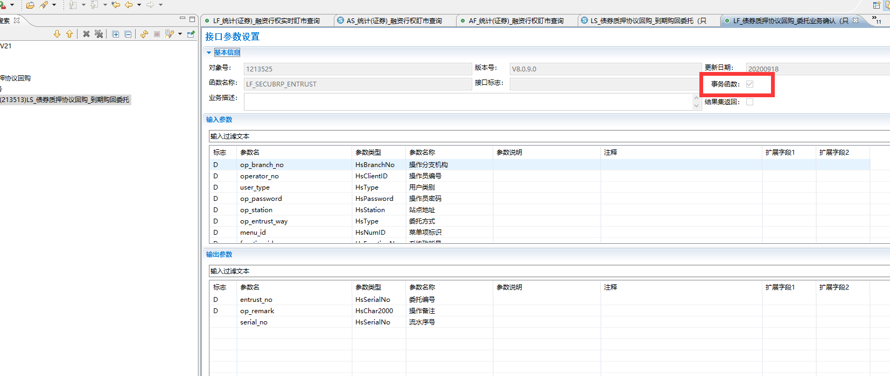
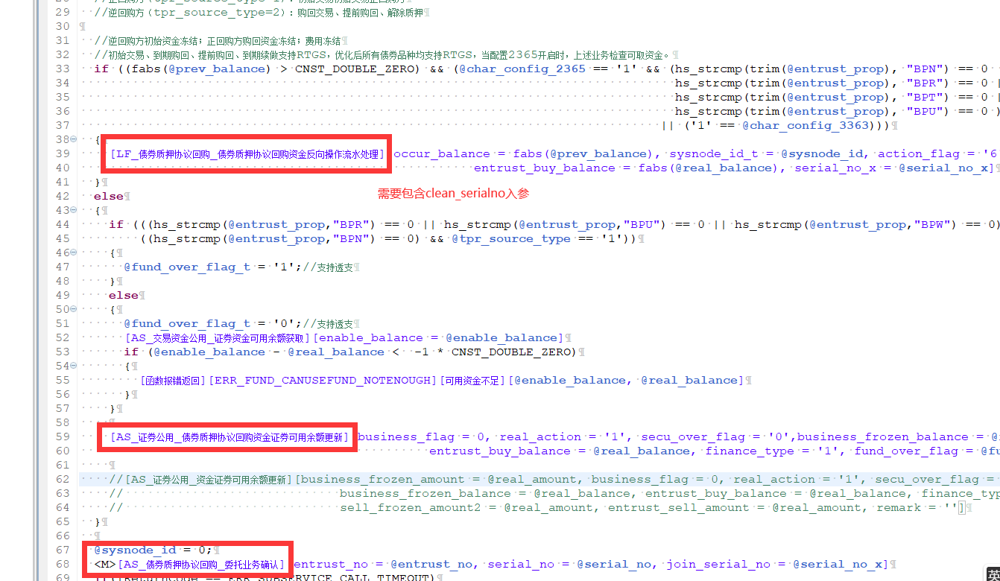

# 冲销流水号cancel_serialno

冲销流水号格式：HS_LS_EALL#0#11:15:29.707##428

冲销流水号是在中间件LS或AS上获取的一个流水号，

LF中勾选`事务函数` ，会自动获取冲销流水号，也可以通过使用：GetCancelSerialNo(lpContext, @cancel_serialno); 函数获取冲销流水号，

一般同一个LF中调用多个AS,多个LF插表操作时，认为是在一个“事务”中完成，因此记录的冲销流水号尽量保持一致，

eg：

​    协议回购业务，LF_债券质押协议回购\_委托业务确认中，勾选事务函数，这个LF同时处理了资金表fundreal、委托表cbpentrust、股份表stockreal表，这三个表的cancel_serialno字段要保持一致，以便后面查问题，因此需要勾选“事务函数”

​    同时，在LF调用的LF和AS中需要增加clean_serailno入参作为传入，并且不再使用GetCancelSerialNo函数重新获取冲销流水号

