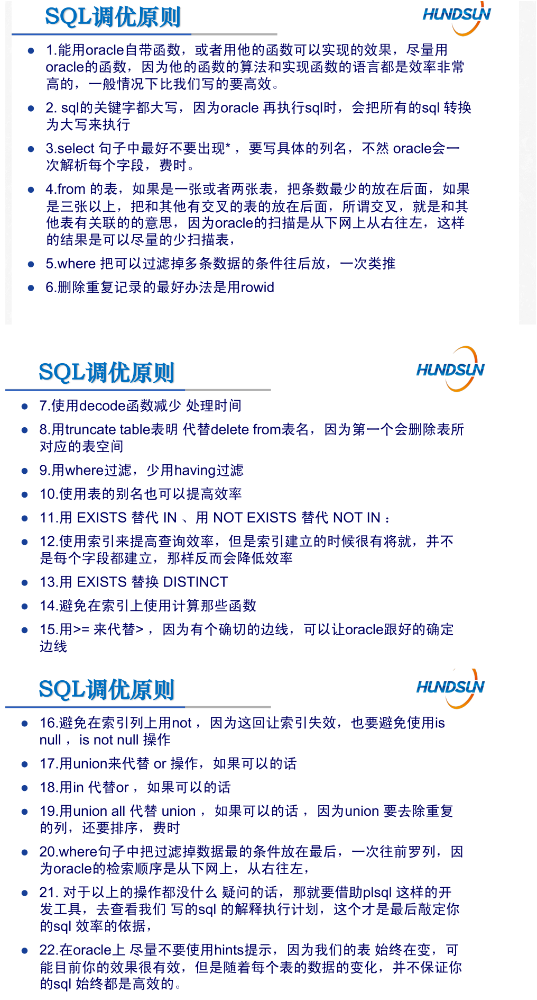

# 缺陷分析问题记录

- 20210518

> 1. 编写[通用select查询]时，查看预览代码，如果有分支时，测试每个分支。
>
> 2. 
> 3. **通用报表一定要在sqlplus中测试一遍！！**
> 4. 增值业务上线说明要写清业务许可证
> 5. 如果用select into的话使用[PROC语句]就可以，不用[PROC语句块]
> 6. 周边错误号的外部错误号转换通过中间件上的xml配置，注意周边接口勾选O标记
> 7. 关键字段date_clear赋值时注意值是否符合规范。
> 8. 字段扩位，拼op_remark的时候，一定要注意截取长度最大值！！

