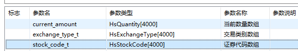

# 融资行权质押还款

212928-LS\_股票质押融资申购\_初始代码输入确认

### 入参

- srp_kind_days（产品天数）
- fund_account
- stock_code
- funder_no：融出方编号
- impawn_amount ： 质押数量
- entrust_balance：委托数量
- exchange_type:市场
- join_contract_id：关联合同号
- srp_kind:gabon::gabon:票质押产品类型
- impawn_busin_type：质押业务类别
- stock_account：证券账户
- stock_property：股份性质
- client_id：客户编号
- execv_lock_flag：高管锁定股份标志
- shdc_stock_type：证券类别
- shdc_circulate_type:流通类型
- shdc_market_year：挂牌年份
- lift_date：解禁日期

对于证券-自主行权-融资行权质押还款菜单，会传入的入参包括：

1. srp_kind_days（产品天数）
2. fund_account
3. srp_kind：传入2-融资可取或3-融资可用
4. stock_code（可传入可不传入）
5. funder_no：融出方编号
6. exchange_type
7. impawn_busin_type 传入1
8. branch_no
9. 其余均未传入，取默认值0或空格

# LF\_股票质押融资申购\_初始代码输入确认

> 1. 如果srp_kind为空格，默认取0
> 2. 如果impawn_busin_type为空格，默认取0
> 3. AS\_股票质押融资申购(存管)\_客户综合信息获取
>
> >AS\_股票质押融资申购(存管)\_客户综合信息获取
> >
> >1. 如果money_type为空，则默认取0
> >2. 根据branch_no获取allbranch表对应的@company_no
> >3. 获取系统配置@char_config_2177，@int_config_2238，@str_config_2289，@char_config_2322
> >4. 获取@str_config_2289的第一位作为@str_config
> >5. AF\_存管公用(证券)\_客户综合业务授信信息获取
> >
> >> AF\_存管公用(证券)\_客户综合业务授信信息获取
> >>
> >> 1. 如果en_cbpbusi_type为空，@srp_kind不为空，
> >>
> >>    则：当srp_kind为0，en_cbpbusi_type取004-股票质押式回购，
> >>
> >>    ​       当srp_kind为1，en_cbpbusi_type取101-股票质押融资申购，
> >>
> >>    ​	   当srp_kind为2，en_cbpbusi_type取102-股票质押融资可取，
> >>
> >>    ​       当srp_kind为3，en_cbpbusi_type取103-股票质押融资可用，
> >>
> >>    ​       当srp_kind为4，en_cbpbusi_type取106-快速股票质押，
> >>
> >>    ​      其他场景取空格
> >>
> >> 2. 查询arpcrquota表where money_type = '0' 
> >>
> >>    ​                                    and cbpacct_type = ' ' and **en_cbpbusi_type = @en_cbpbusi_type** 
> >>
> >>    ​                                    and fund_account = @fund_account
> >>
> >>    获取以下字段：
> >>
> >>    @arp_credit_quota,约定授信额度
> >>
> >>     @arp_credit_rate, 客户授信比例
> >>
> >>    @risk_rate, 客户信用风险比率
> >>
> >>    @en_cbpbusi_type, 允许综合业务类型
> >>
> >>    @break_times, 违约次数
> >>
> >>    @curr_break_times, 当前违约次数
> >>
> >>    @blacklist_flag, 黑名单标志
> >>
> >>    @black_times, 进黑名单违约次数
> >>
> >>    @self_credit_quota,自营授信额度
> >>
> >> 3. 如果查询不到对应数据，查询arpcrquota表
> >>
> >>    where money_type = '0' and cbpacct_type = ' ' and **instr(en_cbpbusi_type, @en_cbpbusi_type) > 0** and fund_account = @fund_account
> >>
> >> 4. 如果查询不到对应数据，查询arpcrquota表
> >>
> >>    where money_type = '0' and cbpacct_type = ' ' and **en_cbpbusi_type = '!'**  and fund_account = @fund_account
> >>
> >> 5. 如果还是找不到对应数据，
> >>
> >> ​       若2177开关为1,且开关2238的值大于0,则将@arp_credit_rate和@risk_rate都置为1
> >>
> >> ​      若2177开关为1,且开关2238的值不大于0,则报错：授信表记录不存在
> >>
> >> ​      若2177开关为0，@arp_credit_rate和@risk_rate都置为1
> >>
> >> ​      @blacklist_flag := '0';
> >
> >6. 如果是上海市场
> >
> >> - 如果2289第一位配置为1，（2289配置：左起第1位:综合业务是否启用统一额度管理(统一额度部署在hs_cash库)）
> >>
> >>   获取**hs_cash用户**下的srpquota表,匹配条件：where company_no = @company_no and exchange_type = '!' and srp_kind = @srp_kind;
> >>
> >>   获取表的min_interest_days(最低计息天数)、interest_cycle(计息周期)、srp_one_down_limit(单笔委托下限)、srp_max_days(最大委托时间)字段，分别赋值给**@min_interest_days、@interest_cycle、@srp_one_down_limit、@srp_max_days**
> >>
> >> - 如果2289第一位配置不为1，![image-20210706155330650]
> >>
> >>   获取**hs_asset用户**下的srpquota表,匹配条件：where company_no = @company_no and exchange_type = '!' and srp_kind = @srp_kind;
> >>
> >>   获取表的min_interest_days(最低计息天数)、interest_cycle(计息周期)、srp_one_down_limit(单笔委托下限)、srp_max_days(最大委托时间)字段，分别赋值给**@min_interest_days、@interest_cycle、@srp_one_down_limit、@srp_max_days**
> >
> >7. 如果是深圳市场
> >
> >> - 如果2289第一位配置为1，（2289配置：左起第1位:综合业务是否启用统一额度管理(统一额度部署在hs_cash库)）
> >>
> >>   获取**hs_cash用户**下的srpquota表,匹配条件：where company_no = @company_no and exchange_type = '!' and srp_kind = @srp_kind;
> >>
> >>   获取表的min_interest_days(最低计息天数)、interest_cycle(计息周期)、srp_one_down_limit(单笔委托下限)、srp_max_days(最大委托时间)字段，分别赋值给@min_days、@count_days、@down_limited、@limit_days
> >>
> >> - 如果2289第一位配置不为1，
> >>
> >>   获取**hs_asset用户**下的srpquota表,匹配条件：where company_no = @company_no and exchange_type = '!' and srp_kind = @srp_kind;
> >>
> >>   获取表的min_interest_days(最低计息天数)、interest_cycle(计息周期)、srp_one_down_limit(单笔委托下限)、srp_max_days(最大委托时间)字段，分别赋值给@min_days、@count_days、@down_limited、@limit_days
> >
> >8. 获取出资方信息
> >
> >> 查询srpfund表where company_no = @company_no and funder_no = @funder_no，获取字段funder_ratio(折算率系数)、funder_rate(利率系数)、status(状态)、funder_type(融出方类型)、stock_account(证券代码)、szdc_stock_account(深圳股东账户)，分别赋值给**@funder_ratio, @funder_rate, @status, @funder_type, @stock_account_t, @szdc_stock_account**
> >>
> >> 查询不到数据则报错
> >
> >9. 如果@join_contract_id不为空
> >
> >> ​         select real_date_back, expire_year_rate, exchange_type, date_back
> >> ​          into **@date_back, @expire_year_rate, @join_exchange_type, @end_date**
> >> ​          from srpcontract
> >> ​         where srp_contract_type = '0'          //只能对于初始合约进行补充
> >> ​           and srp_contract_status = '1' //状态：1-生效
> >> ​           and srp_kind = @srp_kind 
> >> ​           and contract_id = @join_contract_id;
> >
> >10. 如果@exchange_type为‘1-上海’，srpfunder表中对应融出方的@stock_account_t为空，则该融出方不能用于上海股票质押
> >
> >11. 如果@exchange_type为‘2-深圳’，srpfunder表中对应融出方的@szdc_stock_account为空，则该融出方不能用于深圳股票质押
> >
> >12.   \[AF\_系统公用\_账户节点信息获取\]\[sysnode_id = @sysnode_id_t]
> >      \[AF\_系统公用\_节点系统信息获取\]\[sysnode_version = @sysnode_version]
> >      \[AF\_系统公用_数据字典名称获取][dict_entry = 1325, subentry = @sysnode_version, dict_prompt = @system_name]
> >
> >    获取系统节点和系统节点版本，并且根据1325数据字典获取系统节点版本对应的汉语解释
> >
> >13. if (@entrust_date == 0)
> >      {
> >        \[AF\_系统公用\_证券交易参数获取][init_date = @entrust_date, exchange_type='1']
> >      }
> >
> >14. 如果@join_contract_id为空
> >
> >> if (0 == @srp_kind_days)
> >> {
> >>   \[函数报错返回]\[ERR\_SECU\_SRP\_KIND\_DAYS\_ERROR]\[产品天数不能为空][@srp\_kind\_days]
> >> }
> >>
> >> **@date_back = hs_dateadd(@entrust_date, @srp_kind_days + 1);//多取一天，再取上一交易日**
> >>
> >> //快速股票质押增加申报日期计算
> >> if ('4' == @srp_kind)
> >> {
> >>   if (0 == hs_strcmp(@exchange_type, "1"))  //上海
> >>     @end_date = hs_dateadd(@entrust_date, @srp_max_days + 1);//多取一天，再取上一交易日
> >>   else if (0 == hs_strcmp(@exchange_type, "2"))  //深圳
> >>     @end_date = hs_dateadd(@entrust_date, @limit_days + 1);//多取一天，再取上一交易日
> >> }
>
> 4. 获取[AS\_股票质押融资申购(存管)\_客户综合信息获取]的输出参数：@arp_credit_rate、@risk_rate、@interest_cycle、@funder_ratio、@funder_rate、@status、@count_days、@sysnode_id_t、@date_back、@join_exchange_type、@srp_one_down_limit、@down_limited、@min_interest_days、@min_days、@end_date、@char_config_2322、@sysnode_version、@system_name、@company_no
> 5. 如果@join_contract_id为空
>
> > 如果@char_config_2322为'0' : @date_back=hs_dateadd(@date_back, -1); 获取的date_back在AS中做了日期+1处理，在此处还原为输入日期
> >
> > 如果@char_config_2322不为'0' :
> >
> > \[AS\_用户公用\_下一交易日获取\]\[init_date=@date_back,stage\_num=-1,next_trade_date=@date_back,exchange_type="1",finance_type='1']
>
> 6. 获取3287开关@char_config_3287，
>
>    如果@char_config_3287为0并且@impawn_busin_type不为1并且（@join_contract_id为空或@exchange_type不等于@join_exchange_type）则提示：**不允许开展小额贷业务**
>
> 7. 如果@impawn_busin_type = '1'(融资行权质押还款)
>
> > 1. 如果 @sysnode_version不为空或'0'提示报错：本功能不支持此类业务（只支持08系统）
> >
> > 2. \[LF\_自主行权\_融资行权担保明细查询\]\[action_flag = '1']
> >
> > >  LF\_自主行权\_融资行权担保明细查询:
> > >
> > >  1. 当传入的节点编号为0，或者节点编号不为0，但系统版本为空时，再次获取节点信息
> > >     if (@sysnode_id_t == 0 || (@sysnode_id_t != 0 && isnull(trim(@sysnode_version)) == 0))
> > >     {
> > >      \[AS\_用户公用\_账户节点信息获取][sysnode_id=@sysnode_id_t, sysnode_version=@sysnode_version]
> > >     }
> > >
> > >  2. 如果@action_flag = '1'
> > >
> > >  > 获取2244系统配置@char_config_2244： 0-默认，融资行权时使用担保资产模式；1-融资行权时使用担保证券模式；
> > >  >
> > >  > 如果@char_config_2244为1时：	执行\[LF\_自主行权\_客户履约保障比计算]\[action_in=3, entrust_amount=0]
> > >  >
> > >  > > LF\_自主行权\_客户履约保障比计算
> > >  > >
> > >  > > 1. 如果@char_config_2244 为空格，重新获取2244配置
> > >  > > 2. 如果@char_config_3350 为空格，重新获取3350配置
> > >  > > 3. 重新获取系统节点，@sysnode_id = @sysnode_id_t；执行\[AS\_证券交易\_融资行权卖券还款成交值获取]
> > >  > >
> > >  > > > **\[AS\_证券交易\_融资行权卖券还款成交值获取]**
> > >  > > >
> > >  > > > 1. 如果@init_date =0，重新获取excharg表中市场为2-深圳的init_date作为@init_date
> > >  > > >
> > >  > > > 2. 如果@char_config_2244 为空格，重新获取2244配置
> > >  > > >
> > >  > > > 3. 查询repaydetail表中
> > >  > > >
> > >  > > >    stock_code, 
> > >  > > >    exchange_type, 
> > >  > > >    nvl(sum(business_balance),0) as business_balance,
> > >  > > >    nvl(sum(business_amount),0) as business_amount,
> > >  > > >    nvl(sum(clear_balance),0) as clear_balance
> > >  > > >
> > >  > > >    where stock_sell_type = '0' and init_date = @init_date and fund_account = @fund_account 
> > >  > > >
> > >  > > >    group by stock_code、exchange_type
> > >  > > >
> > >  > > > 4. 获取sql查询的PRO*C记录：
> > >  > > >
> > >  > > > > 根据@stock_code、@exchange_type查询stkcode表，获取@store_unit、@stock_type、@asset_flag(计算市值标志)、
> > >  > > > >
> > >  > > > > @down_price(下限价)、@asset_price(市值价)
> > >  > > > >
> > >  > > > > ***优化点：\[AS\_证券交易\_融资行权卖券还款成交值]中调用\[AF\_系统公用\_融资行权担保标的获取]这个AF无实际意义，获取到的@assure_ratio和@lift_limit_ratio并未使用***
> > >  > > > >
> > >  > > > > 根据@stock_code、@exchange_type、@company_no查询finexeassurecode表**重新获取@stock_type**，获取@assure_ratio(担保折算率)、@lift_limit_ratio(解禁限售股折算率)
> > >  > > > >
> > >  > > > > if ((@action_in == 0) && (@char_config_2244 == '0')) //担保资产模式下,融资行权委托时,按照跌停价计算
> > >  > > > >
> > >  > > > > ***疑问点：使用down_price计算price的使用不用乘以@store_unit吗***
> > >  > > > >
> > >  > > > > ​    @price = @down_price;
> > >  > > > > else 
> > >  > > > > ​    @price = @asset_price; //担保证券模式下,委托、担保提交提取时都按照市值价来计算
> > >  > > > >
> > >  > > > > @total_market_value += @price * @business_amount;//总市值
> > >  > > > >
> > >  > > > > @total_business_balance += @clear_balance;//总清算金额
> > >  > > > >
> > >  > > > > @sum_business_balance += @business_balance;//总成交金额
> > >  > >
> > >  > > 4. AS\_证券交易\_融资行权卖券还款成交值获取 获取出参@total_market_value、@total_business_balance
> > >  > > 5. 如果2244配置为0
> > >  > >
> > >  > > > 1. 如果@sysnode_version为空或@sysnode_version为0：
> > >  > > >
> > >  > > > 1.1 执行AS获取融资行权证券市值: AS\_证券公用(综合业务)\_融资行权证券市值获取
> > >  > > >
> > >  > > > > **AS\_证券公用(综合业务)\_融资行权证券市值获取**
> > >  > > > >
> > >  > > > > 如果@char_config_2244 为空格，重新获取2244配置
> > >  > > > >
> > >  > > > > 查询fundreal表获取资金资产，@current_balance、@correct_balance、@real_buy_balance、@real_sell_balance、@enable_balance、@entrust_buy_balance
> > >  > > > >
> > >  > > > > - 如果@char_config_2244 = ‘0’，才执行以下内容（担保资产模式）
> > >  > > > >
> > >  > > > > > select a.exchange_type,  a.stock_code, 
> > >  > > > > >
> > >  > > > > > //担保资产模式下，持仓担保市值计算时，不需要考虑冻结、解冻数量，保证客户在融资后资产平
> > >  > > > > >
> > >  > > > > > ​           nvl(sum(**a.current_amount  + a.correct_amount + a.real_buy_amount - a.real_sell_amount**),0.00)
> > >  > > > > >
> > >  > > > > > //**此处的@exchange_type_t, @stock_code_t, @current_amount均为内部变量4000长度的数组，不是标准字段的值**
> > >  > > > > >
> > >  > > > > > into **@exchange_type_t, @stock_code_t, @current_amount**
> > >  > > > > > from stockreal a
> > >  > > > > > where a.money_type = '0'
> > >  > > > > >  and a.fund_account = @fund_account
> > >  > > > > > group by a.exchange_type, a.stock_code
> > >  > > > > >
> > >  > > > > > 
> > >  > > > > >
> > >  > > > > > @correct_flag = '0';
> > >  > > > > >
> > >  > > > > > 遍历数组for (int i = 0;i < 4000;i++)
> > >  > > > > >
> > >  > > > > > {
> > >  > > > > >
> > >  > > > > > ```c++
> > >  > > > > > if (isnull(trim(@exchange_type_t[i])) == 0)//如果数组第i位的市场为空，则跳出循环
> > >  > > > > >   break;
> > >  > > > > > hs_strcpy(@exchange_type,@exchange_type_t[i]);
> > >  > > > > > hs_strcpy(@stock_code,@stock_code_t[i]);
> > >  > > > > > 
> > >  > > > > > //根据@stock_code、@exchange_type、@company_no查询finexeassurecode表，获取@assure_ratio(担保折算率)、@lift_limit_ratio(解禁限售股折算率)
> > >  > > > > > <M>[AF_系统公用_融资行权担保标的获取][assure_ratio=@assure_ratio, lift_limit_ratio=@lift_limit_ratio]
> > >  > > > > > //根据@stock_code、@exchange_type查询stkcode表，获取@store_unit、@stock_type、@asset_flag(计算市值标志)、@down_price(下限价)、
> > >  > > > > > <M>[AF_系统公用_证券代码信息获取][stock_type=@stock_type,store_unit=@store_unit,asset_flag=@asset_flag,down_price=@down_price]
> > >  > > > > > 
> > >  > > > > > 如果@stock_type ='w',则@correct_flag置为'1'
> > >  > > > > > 查询UDP获取@asset_price(市值价)
> > >  > > > > > if (@action_in == 0) //担保资产模式下,考虑客户的持仓市值
> > >  > > > > > 	@price = @down_price * @store_unit;
> > >  > > > > > else                 //否则按市值价计算
> > >  > > > > > 	@price = @asset_price;
> > >  > > > > > //数组循环累加market_value值
> > >  > > > > > @market_value = @market_value + hs_round(@current_amount[i] * @price, 2);
> > >  > > > > > ```
> > >  > > > > >
> > >  > > > > > }
> > >  > > > >
> > >  > > > > **未理解内容：证券数量和资金金额为什么这么计算，不使用frozen_balance、enable_balance等字段**
> > >  > > > >
> > >  > > > > @market_value = @market四舍五入两位小数的结果
> > >  > > > >
> > >  > > > > >@fund_asset = fundreal表中 @current_balance + @correct_balance - @real_buy_balance + @real_sell_balance四舍五入两位小数的结果
> > >  > > > >
> > >  > > > > - 如果@char_config_2244 不为 ‘0’，无其他执行内容，查询fundreal表获取资金资产，@current_balance、@correct_balance、@real_buy_balance、@real_sell_balance、@enable_balance、@entrust_buy_balance后即执行完毕
> > >  > > >
> > >  > > > 1.2 执行 AS\_证券公用(综合业务)\_融资行权证券市值获取@market_value，@enable_balance,@fund_asset
> > >  > > >
> > >  > > > 2. 如果@sysnode_version不为0且不为空，则执行招商特殊模式AS,获取@market_value
> > >  > >
> > >  > > 6. 执行\[AS\_自主行权\_客户履约保障比计算]
> > >  > >
> > >  > > > AS\_自主行权\_客户履约保障比计算:
> > >  > > >
> > >  > > > 1. 如果@init_date =0，重新获取excharg表中市场为2-深圳的init_date作为@init_date
> > >  > > > 2. 如果@char_config_3350 为空格，重新获取3350配置
> > >  > > > 3. 执行\[AF\_自主行权_融资行权合同履约保障线获取]，获取@margin_focus_ratio, @margin_alert_ratio, @margin_treat_ratio, @margin_draw_ratio
> > >  > > >
> > >  > > > > 查询finexecontract表中 取客户所有合同履约保障比的最大值作为衡量客户履约保障比的标准
> > >  > > > >
> > >  > > > > select nvl(max(margin_focus_ratio),0),
> > >  > > > >
> > >  > > > > ​           nvl(max(margin_alert_ratio),0),
> > >  > > > >
> > >  > > > > ​           nvl(max(margin_treat_ratio),0),
> > >  > > > >
> > >  > > > > ​           nvl(max(margin_draw_ratio),0)
> > >  > > > >   into @margin_focus_ratio, @margin_alert_ratio, @margin_treat_ratio, @margin_draw_ratio
> > >  > > > >
> > >  > > > > where (trim(@sopt_code) is null or sopt_code  = @sopt_code)
> > >  > > > >          and finexe_contract_type = '0'
> > >  > > > >          and finexe_contract_status in ('0','1','2','5','6','7')
> > >  > > > >          and fund_account = @fund_account;
> > >  > > >
> > >  > > > 4. 如果@char_config_2244为'1'
> > >  > > >
> > >  > > > > 执行\[AF\_自主行权_客户履约保障比计算]
> > >  > > > >
> > >  > > > > 1. \[AF\_自主行权_融资行权质押还款值获取][impawn_balance=@impawn_balance,impawn_market_value=@impawn_market_value]
> > >  > > > >
> > >  > > > > > 1. 如果@init_date =0，重新获取excharg表中市场为2-深圳的init_date作为@init_date
> > >  > > > > >
> > >  > > > > > 2. 获取2245配置@int_config_2245
> > >  > > > > >
> > >  > > > > > 3. 配置char_config_2244没有输入,则重新获取2244配置
> > >  > > > > >
> > >  > > > > > 4. 捞取当天的质押还款合同
> > >  > > > > >
> > >  > > > > > 5. ```plsql
> > >  > > > > >    [PRO*C结果集语句][select fund_account,
> > >  > > > > >                             stock_code,
> > >  > > > > >                             exchange_type,
> > >  > > > > >                             nvl(sum(entrust_amount),0) as impawn_amount,
> > >  > > > > >                             nvl(sum(entrust_balance),0) as entrust_balance
> > >  > > > > >                        from srpcontract 
> > >  > > > > >                       where init_date = @init_date    --捞取当天的质押还款合同
> > >  > > > > >                         and impawn_busin_type = '1'
> > >  > > > > >                         and srp_contract_status in('1','3','6','7','8','9')  --捞取生效的合同以及后续操作合同
> > >  > > > > >                         and fund_account = @fund_account
> > >  > > > > >                       group by stock_code,exchange_type,fund_account]
> > >  > > > > >                   
> > >  > > > > >    ```
> > >  > > > > >
> > >  > > > > > 6. ```c++
> > >  > > > > >    //类似前面的计算市值的方法，注意此处2244配置为0，使用的@down_price乘以了@assure_ratio，并且也没有使用@store_unit
> > >  > > > > >    [PRO*C记录获取开始][@fund_account, @stock_code_t, @exchange_type_t, @impawn_amount, @entrust_balance]
> > >  > > > > >    {
> > >  > > > > >    	//查询证券对应的市值
> > >  > > > > >        <E>[AF_系统公用_证券代码信息获取][stock_code=@stock_code_t,exchange_type=@exchange_type_t,stock_type=@stock_type,store_unit=@store_unit,asset_flag=@asset_flag,down_price=@down_price]
> > >  > > > > >       @asset_price = GetSecuAssetPrice(lpContext,@exchange_type_t,@stock_code_t,@stock_type,@store_unit,@asset_flag);
> > >  > > > > >                         
> > >  > > > > >          [AF_系统公用_融资行权担保标的获取][stock_code=@stock_code_t,exchange_type=@exchange_type_t,assure_ratio=@assure_ratio,lift_limit_ratio=@lift_limit_ratio,assure_price=@assure_price]
> > >  > > > > >    	if ('1' == @char_config_2244)     //广发模式
> > >  > > > > >    	{
> > >  > > > > >    		@price = @asset_price;
> > >  > > > > >    	}
> > >  > > > > >    	else
> > >  > > > > >    	{
> > >  > > > > >    	@price = @down_price * @assure_ratio;
> > >  > > > > >    	}
> > >  > > > > >                         
> > >  > > > > >    	@impawn_market_value += @price * @impawn_amount;
> > >  > > > > >    	@impawn_balance += @entrust_balance;
> > >  > > > > >    }
> > >  > > > > >    [PRO*C记录获取结束][@fund_account, @stock_code_t, @exchange_type_t, @impawn_amount, @entrust_balance]
> > >  > > > > >    ```
> > >  > > > > >
> > >  > > > > > 7. 输出@impawn_market_value和@impawn_balance
> > >  > > > > >
> > >  > > > > > 8. **疑问点：为什么获取了2245配置，但是又不考虑2245配置，是否需要考虑？**
> > >  > > > > >
> > >  > > > > > 9. **疑问点：为什么此处计算price的时候@down_price要乘以@assure_ratio,其他计算price的时候又不用乘？**
> > >  > > > >
> > >  > > > > 2. 执行\[AF\_自主行权\_融资行权大宗违约卖出市值获取]
> > >  > > > >
> > >  > > > >    [total_market_value = @total_market_value_t, total_business_balance = @total_business_balance_t]
> > >  > > > >
> > >  > > > > > 获取大宗卖出市值
> > >  > > > > >
> > >  > > > > > 1. 如果@init_date =0，重新获取excharg表中市场为2-深圳的init_date作为@init_date
> > >  > > > > >
> > >  > > > > > 2. 配置char_config_2244没有输入,则重新获取2244配置
> > >  > > > > >
> > >  > > > > > 3. 查询当天的cbpentrust表大宗委托
> > >  > > > > >
> > >  > > > > > 4. ```plsql
> > >  > > > > >    [PRO*C结果集语句][select a.stock_code, 
> > >  > > > > >                             a.exchange_type, 
> > >  > > > > >                             nvl(sum(a.business_balance),0) as business_balance,
> > >  > > > > >                             nvl(sum(a.business_amount),0) as business_amount,
> > >  > > > > >                             nvl(sum(a.clear_balance),0) as clear_balance
> > >  > > > > >                        from cbpentrust a
> > >  > > > > >                       where a.init_date = @init_date   
> > >  > > > > >                         and (a.entrust_type = 'J' or a.entrust_type = 'K')                  
> > >  > > > > >                         and a.fund_account = @fund_account
> > >  > > > > >                       group by a.stock_code,a.exchange_type]
> > >  > > > > >    ```
> > >  > > > > >
> > >  > > > > > 5. ```C++
> > >  > > > > >    [PRO*C记录获取开始][@stock_code, @exchange_type, @business_balance, @business_amount, @clear_balance]
> > >  > > > > >    {
> > >  > > > > >    	//查询证券对应的市值
> > >  > > > > >    	<E>[AF_系统公用_证券代码信息获取][stock_type=@stock_type,store_unit=@store_unit,asset_flag=@asset_flag,down_price=@down_price]
> > >  > > > > >    @asset_price = GetSecuAssetPrice(lpContext,@exchange_type,@stock_code,@stock_type,@store_unit,@asset_flag);
> > >  > > > > >    	<E>[AF_系统公用_融资行权担保标的获取][stock_type = @stock_type ,assure_ratio=@assure_ratio,lift_limit_ratio=@lift_limit_ratio]
> > >  > > > > >    	if ((@action_in == 0) && (@char_config_2244 == '0')) //担保资产模式下,融资行权委托时,按照跌停价计算
> > >  > > > > >    		@price = @down_price;
> > >  > > > > >    	else 
> > >  > > > > >            @price = @asset_price; //担保证券模式下,委托、担保提交提取时都按照市值价来计算
> > >  > > > > >    	@total_market_value += @price * @business_amount;
> > >  > > > > >    	@total_business_balance += @clear_balance;
> > >  > > > > >    	@sum_business_balance += @business_balance;
> > >  > > > > >    }
> > >  > > > > >    ```
> > >  > > > > >
> > >  > > > > > 6. **疑问点：此处不考虑2245配置，@down_price也不用乘@assure_ratio？**
> > >  > > > > >
> > >  > > > > > 7. 获取 total_market_value、total_business_balance 分别赋值给@total_market_value_t、@total_business_balance_t
> > >  > > > >
> > >  > > > > 3. 执行\[AF\_自主行权\_融资行权担保市值获取][sum_market_value=@sum_market_value,begin_market_value=@begin_market_value,assure_market_value=@assure_market_value]
> > >  > > > >
> > >  > > > > > \[AF\_自主行权\_融资行权担保市值获取]
> > >  > > > > >
> > >  > > > > > 1. 获取2245配置开关@int_config_2245
> > >  > > > > > 2. 如果sysnode_version为0，为空为10，为11，或者2244配置为1,则：
> > >  > > > > >
> > >  > > > > > > 1. 查询assurestock表
> > >  > > > > > >
> > >  > > > > > > ```plsql
> > >  > > > > > > [PRO*C结果集语句][select a.exchange_type,
> > >  > > > > > >                            a.stock_code,
> > >  > > > > > >                            nvl(sum(a.impawn_amount + a.pre_impawn_amount),0) as last_amount
> > >  > > > > > >                       from assurestock a
> > >  > > > > > >                      where a.fund_account = @fund_account
> > >  > > > > > >                        and a.assure_type = '0'              --只累计融资行权担保
> > >  > > > > > >                      group by a.stock_code,a.exchange_type]
> > >  > > > > > > ```
> > >  > > > > > >
> > >  > > > > > > 2. 结果集处理
> > >  > > > > > >
> > >  > > > > > > ```c++
> > >  > > > > > > [PRO*C记录获取开始][@exchange_type_t,@stock_code_t,@last_amount]
> > >  > > > > > > {
> > >  > > > > > > 	<E>[AF_系统公用_证券代码信息获取][stock_code=@stock_code_t, exchange_type=@exchange_type_t]
> > >  > > > > > > 	获取@asset_price市值价
> > >  > > > > > > 	<E>[AF_系统公用_融资行权担保标的获取][stock_code=@stock_code_t, exchange_type=@exchange_type_t,
> > >  > > > > > >                                     assure_ratio=@assure_ratio,lift_limit_ratio=@lift_limit_ratio,
> > >  > > > > > >                                     execv_assure_ratio=@execv_assure_ratio, assure_price=@assure_price]
> > >  > > > > > > 	@begin_amount = @last_amount;
> > >  > > > > > >     if(@stock_code_t == @stock_code且@exchange_type_t == @exchange_type)//担保标的代码与行权标的代码匹配
> > >  > > > > > >     {
> > >  > > > > > >         @last_amount = @last_amount + @entrust_amount;
> > >  > > > > > >         if ('1' == @executives_flag)//高管：初始担保物不包括与行权标的相同的担保证券
> > >  > > > > > >         {
> > >  > > > > > >             @assure_ratio = @execv_assure_ratio;
> > >  > > > > > >             @begin_amount = 0;
> > >  > > > > > >         }
> > >  > > > > > >         else
> > >  > > > > > >         {
> > >  > > > > > >             //非高管时当非高管融资比率大于0时，初期市值排除与行权标的相同的担保证券
> > >  > > > > > >             if (fabs(@fin_ratio_t) > CNST_DOUBLE_ZERO) 
> > >  > > > > > >             {
> > >  > > > > > >                 @begin_amount = 0;
> > >  > > > > > >             }
> > >  > > > > > >         }
> > >  > > > > > >         @match_flag = '1';
> > >  > > > > > >     }
> > >  > > > > > >     if ('1' == @char_config_2244)//担保证券模式
> > >  > > > > > >     {
> > >  > > > > > >         if (0 == @action_in)//如果是初始委托
> > >  > > > > > >         {
> > >  > > > > > >             if (@int_config_2245 <= 0)              //委托时,price 为折算价
> > >  > > > > > >                 @price = @asset_price;
> > >  > > > > > >             else
> > >  > > > > > >                 @price = @assure_price;
> > >  > > > > > >             @assure_market_value += @price * @assure_ratio * @last_amount;    //计算最大融资金额时使用的累计市值
> > >  > > > > > >             @begin_market_value += @price * @assure_ratio * @begin_amount;    //不包括行权标的的对应担保物市值  
> > >  > > > > > >         }
> > >  > > > > > >         @sum_market_value += @asset_price * @last_amount; //委托、担保提交提取时，计算履约保障比时使用的累计市值,市值不考虑assure_ratio
> > >  > > > > > >     }
> > >  > > > > > >     else//担保资产模式
> > >  > > > > > >     {
> > >  > > > > > >         if (0 == @action_in)
> > >  > > > > > > 			@price = @down_price * @store_unit;
> > >  > > > > > > 		else
> > >  > > > > > > 			@price = @asset_price;
> > >  > > > > > > 		@sum_market_value += @price * @last_amount;
> > >  > > > > > >     }
> > >  > > > > > > }
> > >  > > > > > > ```
> > >  > > > > > 3. 如果合同表中未匹配到本次行权标的stock_code,sum_market_value增加stock_code对应的市值
> > >  > > > > >
> > >  > > > > > > ```C++
> > >  > > > > > > if ('1' != @match_flag && fabs(@entrust_amount) > CNST_DOUBLE_ZERO)
> > >  > > > > > > {
> > >  > > > > > > 	[AF_系统公用_证券代码信息获取][stock_code=@stock_code, exchange_type=@exchange_type, stock_type=@stock_type,                               store_unit=@store_unit,asset_flag=@asset_flag,down_price=@down_price]
> > >  > > > > > >     @asset_price获取
> > >  > > > > > > 	[AF_系统公用_融资行权担保标的获取][stock_code=@stock_code, exchange_type=@exchange_type, 
> > >  > > > > > >                                   assure_ratio=@assure_ratio, lift_limit_ratio=@lift_limit_ratio,
> > >  > > > > > >                          		  assure_price=@assure_price]
> > >  > > > > > >     if ('1' == @char_config_2244)
> > >  > > > > > >     {
> > >  > > > > > >       if (0 == @action_in)
> > >  > > > > > >       {
> > >  > > > > > >         if (@int_config_2245 <= 0)      //委托时,price 为折算价
> > >  > > > > > >           @price = @asset_price;
> > >  > > > > > >         else
> > >  > > > > > >           @price = @assure_price;
> > >  > > > > > >         @assure_market_value += @price * @assure_ratio * @entrust_amount;
> > >  > > > > > >       }
> > >  > > > > > >       @sum_market_value += @asset_price * @entrust_amount;
> > >  > > > > > > 
> > >  > > > > > >     }
> > >  > > > > > >     else
> > >  > > > > > >     {
> > >  > > > > > >       //异构系统担保资产模式，开仓委托时，高管客户需要考虑初始锁定比例 修改单：M201701090581
> > >  > > > > > >       //担保资产模式，开仓时市值按照down_price计算，其他情况按照asset_price计算
> > >  > > > > > >       if (0 == @action_in)
> > >  > > > > > >         @price = @down_price * @store_unit * (1 - @execv_lock_ratio);
> > >  > > > > > >       else
> > >  > > > > > >         @price = @asset_price;
> > >  > > > > > >       @sum_market_value += @price * @entrust_amount;
> > >  > > > > > >     }
> > >  > > > > > > }
> > >  > > > > > > ```
> > >  > > > > > 
> > >  > > > > >4. @sum_market_value/@begin_market_value/@assure_market_value 四舍五入取值
> > >  > > > > > 5. 获取输出参数@sum_market_value/@begin_market_value/@assure_market_value
> > >  > > > > 
> > >  > > > >4. ```c++
> > >  > > > >    //sum_market_value 质押证券总市值-卖券还款成交市值-股票质押证券市值-大宗违约卖出市值
> > >  > > > >    @sum_market_value = @sum_market_value - @total_market_value - @impawn_market_value - @total_market_value_t;
> > >  > > > >    ```
> > >  > > > > 
> > >  > > > >5. 执行\[AF\_自主行权_融资行权总负债获取]
> > >  > > > > 
> > >  > > > >> 1. 查询finexecontract表负债信息,获取总负债，如果no_data_found不报错
> > >  > > > > >
> > >  > > > > > ```plsql
> > >  > > > > > select nvl(sum(a.entrust_balance - a.repaid_balance + a.unsettle_interest + a.overdue_fine_balance - a.repaid_overdue_fine_balance),0.00),
> > >  > > > > >              nvl(sum(a.sopt_tax),0.00),
> > >  > > > > >              nvl(sum(a.bfare_balance),0.00),
> > >  > > > > >              nvl(sum(a.entrust_balance - a.repaid_balance),0.00),
> > >  > > > > >              nvl(sum(a.overdue_fine_balance - a.repaid_overdue_fine_balance),0.00)
> > >  > > > > >         into @debit_balance,@sum_paid_tax,@sum_pay_balance,@csfc_fin_debit,@balance
> > >  > > > > >         from finexecontract a
> > >  > > > > >        where a.finexe_contract_status in ('0','1','2','5','6','7') 
> > >  > > > > >          and a.finexe_contract_type= '0'
> > >  > > > > >          and a.fund_account = @fund_account;
> > >  > > > > > ```
> > >  > > > > >
> > >  > > > > > 2. 如果2244配置为0，如果no_data_found不报错
> > >  > > > > >
> > >  > > > > > ```plsql
> > >  > > > > > --担保资产模式下,捞取未做下账处理的自有资金使用部分，从客户担保资产中剔除该部分资金资产used_self_balance
> > >  > > > > > --T日委托，T日日终将自有资金使用部分做下账处理，并且把合同更新为1-确认状态，故只有0-委托状态合同的自有资金使用部分是未做下账处理的
> > >  > > > > > select nvl(sum(a.self_balance),0.00)
> > >  > > > > >         into @used_self_balance
> > >  > > > > >   from finexecontract a
> > >  > > > > >  where a.finexe_contract_status = '0'
> > >  > > > > >        and a.finexe_contract_type= '0'
> > >  > > > > >        and a.fund_account = @fund_account;
> > >  > > > > > ```
> > >  > > > > >
> > >  > > > > > 3. 如果@char_config_3350配置为1，如果no_data_found，@bad_fine_balance_a = 0
> > >  > > > > >
> > >  > > > > >    3350配置：0 - 不允许（默认）；1 - 允许；1.行权委托按照融资行权个性参数表信息检查和委托；2.调整履约保障比算法中负债算法：行权融资负债=所有行权融资合约本金+累计利息+罚息；3.融资行权合同自动转质押；4.调整卖券还款顺序。仅支持招商异构
> > >  > > > > >
> > >  > > > > > ```plsql
> > >  > > > > > select nvl(sum(a.bad_fine_balance - a.repaid_bad_fine_balance),0.00)
> > >  > > > > >   into @bad_fine_balance_a
> > >  > > > > >   from badfineinterest a
> > >  > > > > >  where a.fund_account = @fund_account;
> > >  > > > > > ```
> > >  > > > > >
> > >  > > > > > 4. @debit_balance = @debit_balance + @entrust_balance + @bad_fine_balance_a;
> > >  > > > > > 5. 获取输出参数@debit_balance, @csfc_fin_debit
> > >  > > > > 
> > >  > > > >6. ```c++
> > >  > > > >    //debit_balance = 融资行权合同负债 - 卖券还款成交金额 - 股票质押委托资金 - 大宗违约卖出成交金额
> > >  > > > >    @debit_balance = @debit_balance - @total_business_balance - @impawn_balance - @total_business_balance_t;
> > >  > > > >    ```
> > >  > > > > 
> > >  > > > >7. ```c++
> > >  > > > >    //计算履约比
> > >  > > > >    if (@debit_balance > CNST_DOUBLE_ZERO)
> > >  > > > >        @av_margin_ratio = hs_round(@sum_market_value / @debit_balance,4);
> > >  > > > >    else
> > >  > > > >        //客户负债为0时,履约保障比显示为-1
> > >  > > > >        @av_margin_ratio = -1;
> > >  > > > >    ```
> > >  > > > > 
> > >  > > > >8. 获取出参：
> > >  > > > > 
> > >  > > > >   av_margin_ratio = @av_margin_ratio, debit_balance = @debit_balance, sum_market_value = @sum_market_value,
> > >  > > > >    csfc_fin_debit = @csfc_fin_debit, begin_market_value = @begin_market_value, assure_market_value = @assure_market_value
> > >  > > > 
> > >  > > >5. 如果@char_config_2244不为1
> > >  > > > 
> > >  > > >> 执行\[AF\_自主行权_华泰客户履约保障比计算]
> > >  > > > >
> > >  > > > > 1. 获取系统配置3240：@char_config_3240
> > >  > > > >
> > >  > > > > 2. ```c++
> > >  > > > >    //这三个AF的实现在前面已经写了，可以看上面怎么取的值
> > >  > > > >    [AF_自主行权_融资行权担保市值获取][sum_market_value=@sum_market_value]
> > >  > > > >                
> > >  > > > >    [AF_自主行权_融资行权大宗违约卖出市值获取][total_market_value = @total_market_value_t, 
> > >  > > > >                                        total_business_balance=@total_business_balance_t]
> > >  > > > >                
> > >  > > > >    [AF_自主行权_融资行权总负债获取][debit_balance=@debit_balance, sum_paid_tax=@sum_paid_tax, balance=@balance, 
> > >  > > > >                                sum_pay_balance=@sum_pay_balance, used_self_balance=@used_self_balance]
> > >  > > > >                
> > >  > > > >    ```
> > >  > > > >
> > >  > > > > 3. 查询股票质押的总委托金额
> > >  > > > >
> > >  > > > > ```plsql
> > >  > > > > if @char_config_3240 = '1' then
> > >  > > > > 	@table_name := 'srpcompact';
> > >  > > > >       begin
> > >  > > > >         select nvl(sum(entrust_balance), 0)
> > >  > > > >           into @sum_balance
> > >  > > > >           from srpcompact
> > >  > > > >          where instr('1,2,3,6,7,8,9', srp_contract_status) > 0
> > >  > > > >            and fund_account = @fund_account
> > >  > > > >            and entrust_date < @init_date;
> > >  > > > >       exception
> > >  > > > >         when NO_DATA_FOUND then
> > >  > > > >           null;
> > >  > > > >         when others then
> > >  > > > >           [PRO*C语句块事务内报错返回][ERR_ASSET_QRY_TABLERECORD_FAIL][查询表记录失败][@table_name, @fund_account]
> > >  > > > >       end; 
> > >  > > > >     else
> > >  > > > >       begin
> > >  > > > >         select nvl(sum(entrust_balance), 0)
> > >  > > > >           into @sum_balance
> > >  > > > >           from srpcontract
> > >  > > > >          where instr('1,2,3,6,7,8,9', srp_contract_status) > 0
> > >  > > > >            and fund_account = @fund_account
> > >  > > > >            and entrust_date < @init_date;
> > >  > > > >       exception
> > >  > > > >         when NO_DATA_FOUND then
> > >  > > > >           null;
> > >  > > > >         when others then
> > >  > > > >           [PRO*C语句块事务内报错返回][ERR_ASSET_QRY_SRPCONTRACT_FAIL][查询股票质押合同表失败][@fund_account]
> > >  > > > >       end; 
> > >  > > > > end if;
> > >  > > > > ```
> > >  > > > >
> > >  > > > > 4. 计算总资产、总负债
> > >  > > > >
> > >  > > > > ```c++
> > >  > > > > //market_value:stockreal中所有证券的市值
> > >  > > > > //fund_asset:fundreal中资产：@current_balance + @correct_balance - @real_buy_balance + @real_sell_balance
> > >  > > > > //sum_balance：srpcontract/srpcompact中总共的股票质押融入金额
> > >  > > > > //sum_market_value：融资行权担保资产
> > >  > > > > //total_market_value:已卖券还款市值
> > >  > > > > //used_self_balance:finexecontract表中未入账自有资金使用
> > >  > > > > //self_balance：本次自有资金使用
> > >  > > > > //total_business_balance_t：大宗卖出市值
> > >  > > > > @asset = @market_value + @fund_asset + @sum_balance + @sum_market_value 
> > >  > > > >          - @total_market_value - @used_self_balance - @self_balance - @total_market_value_t;
> > >  > > > > //debit_balance 融资行权合同负债
> > >  > > > > //total_business_balance 卖券还款所得金额
> > >  > > > > //total_business_balance_t 大宗卖出成交金额
> > >  > > > > @debit_balance = @debit_balance - @total_business_balance - @total_business_balance_t;
> > >  > > > > 
> > >  > > > > if (@debit_balance > CNST_DOUBLE_ZERO)
> > >  > > > >     @av_margin_ratio = hs_round(@asset/@debit_balance,4);
> > >  > > > > else
> > >  > > > > 	//客户负债为0时,履约保障比显示为-1 修改单:20151110024
> > >  > > > >     @av_margin_ratio = -1;
> > >  > > > > ```
> > >  > > > >
> > >  > > > > 5. 获取出参 av_margin_ratio=@av_margin_ratio, debit_balance=@debit_balance, sum_market_value=@sum_market_value,
> > >  > > > >                    asset=@asset, balance=@balance
> > >  > > 
> > >  > >7. 获取出参sum_market_value=@sum_market_value, 
> > >  > > 
> > >  > >   ​               asset=@asset, debit_balance=@debit_balance, total_market_value=@total_market_value, 
> > >  > > 
> > >  > >   ​               total_business_balance=@total_business_balance, margin_treat_ratio=@margin_treat_ratio
> > >  > >    ​              margin_draw_ratio=@margin_draw_ratio, margin_focus_ratio=@margin_focus_ratio, margin_alert_ratio=@margin_alert_ratio
> > >  
> > >3. 执行\[AS\_自主行权_融资行权担保品明细获取][assure_type='0']  //查询融资行权的担保品记录
> > >  
> > >> 

